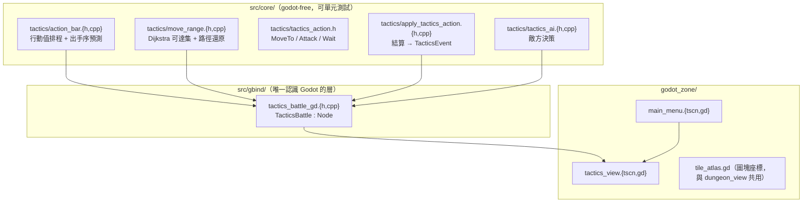
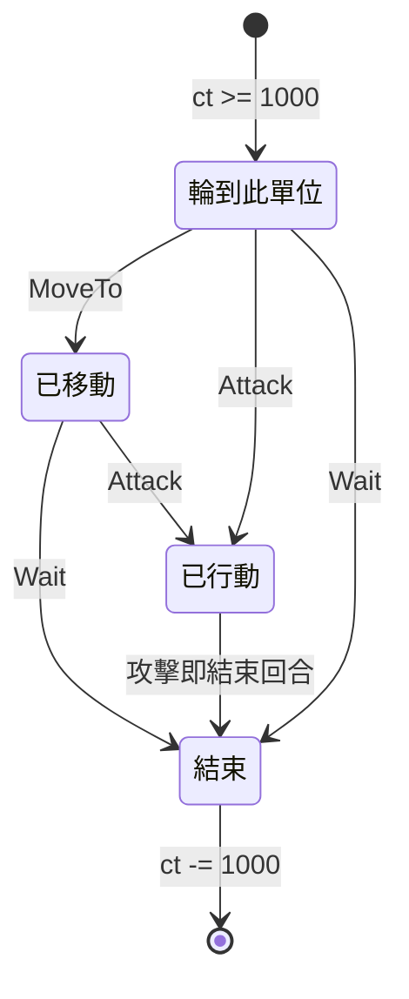

# SRPG 戰棋戰鬥場景設計（2026-07-10）

> 狀態：**已落地**（2026-07-10）。本文現為此切片的設計記錄；程式碼在
> `src/core/tactics/`、`src/gbind/tactics_battle_gd.*`、`godot_zone/tactics_view.*`
> 等處，細節見 [CODE_MAP](../common/code-map/CODE_MAP.md) 與
> [docs/架構與函數說明.md](../../docs/架構與函數說明.md)。§8 Done when 的驗收見文末附註。

## 0. 定位與三個已定案決策

| # | 決策 | 選擇 |
|---|------|------|
| 1 | 與現有 roguelike 的關係 | **平行獨立場景**：共用 ECS／地圖／存檔基建，但回合驅動另寫，互不干涉 |
| 2 | 回合結構 | **單位行動序（行動條）**：依速度累積行動值排序，非陣營相位制 |
| 3 | 本輪範圍 | **最小可玩切片**：能完整打完一場，殲滅一方即分勝負 |

## 1. 最重要的一條約束

行動條**就是** `e9ed694` 重構刪掉的能量排程器（ToME4 行動值模型）。它必須活在
`src/core/tactics/` 自己的模組裡，**不得加回 `TurnEngine`**——地城那側的
「最傳統回合制」是刻意保持精簡的地基，不能再被排程邏輯污染。

沿用歷史設計已定的語意與常數（見
[specs/archive/2026-06-07-action-and-turn-scheduler-design.md](archive/2026-06-07-action-and-turn-scheduler-design.md)
§4、§5 的「A. EnergyInstant」）：

```text
CT_TO_ACT     = 1000   // 行動值達此值才能出手
CT_PER_TICK   = 100    // 速度 100 的單位每 tick 累積 100 → 10 ticks 出手一次
```

出手後 `ct -= CT_TO_ACT`（**不歸零**）——溢出的行動值保留，快角才會正確地
「偶爾連動兩次」。歸零會讓速度差異被吃掉，是這類系統最常見的實作錯誤。

## 2. 模組佈局



共用既有的 `MapData`／`SpatialComponent`／`HealthComponent`／`ActorComponent`／
`EntityManager`／`serialize`。**不共用** `TurnEngine`／`Action`／`apply_action`／
`ActPointComponent`／`ControllerComponent`。

## 3. 新增 component

| Component | 欄位 | 說明 |
|---|---|---|
| `TeamComponent` | `uint8_t team` | 0＝我方、1＝敵方。勝負＝某隊清空 |
| `TacticsUnitComponent` | `move_range, attack_range, speed` | 單位的戰棋屬性 |
| `TurnGaugeComponent` | `int ct` | 行動值，`>= CT_TO_ACT` 即可出手 |

三者皆可序列化，**必須同步 `src/core/serialize/all_components.h`**（專案鐵律）。

## 4. 一個單位的回合

傳統戰棋是「移動一次 + 行動一次」，不是「一回合只做一件事」。故單位回合有子狀態：



- 移動：`move_range` 步內、Dijkstra 可達（牆與**其他單位佔格**皆阻擋），走一次。
- 攻擊：Chebyshev 距離 `<= attack_range` 的敵方單位，選目標，扣血，結束回合。
- 攻擊後不能再移動（移動→攻擊單向）。這是 FE/FFT 的慣例，也讓狀態機保持無環。

## 5. 敵方 AI（最小）

```text
若 射程內有敵人 → 攻擊 HP 最低者
否則 → 在可達集中選「離最近敵人最近」的格子移動；移動後若進入射程 → 攻擊
否則 → Wait
```

純決策函式，回傳 `TacticsAction`，副作用交給 `apply_tactics_action()`——
與 `decide_npc()` 同一個模式，理由相同（可單元測試、世界改動集中一處）。

## 6. gbind 介面（`TacticsBattle : Node`）

延續 `ZoneWorld` 這輪學到的原則：**橋樑層只吐資料，不做圖形決策**。

| 方法 | 回傳 |
|---|---|
| `start_battle(seed)` | — |
| `get_map_width/height()` | int |
| `get_tile_flags()` | `PackedByteArray`（戰棋無戰爭迷霧，只有 walkable） |
| `get_units()` | `Array[Dictionary]`：`id,x,y,team,hp,max_hp,speed,move_range,attack_range` |
| `get_turn_order(n)` | `Array[int]`：接下來 n 個出手的 unit id（行動條 UI） |
| `current_unit()` | int（`-1`＝無） |
| `is_waiting_player()` | bool |
| `get_move_tiles()` | `PackedVector2Array`：目前單位可移動到的格 |
| `get_attack_targets()` | `Array[int]`：目前可攻擊的 unit id |
| `command_move(x,y)` / `command_attack(id)` / `command_wait()` | — |

signal：`turn_started(id)`、`unit_moved(id)`、`unit_attacked(a,b,damage)`、
`unit_died(id)`、`battle_over(winning_team)`。

unit id ＝ `entt::to_integral(entity)`，橋樑層維護 id ↔ entity 對照。

## 7. Godot 場景

- `main_menu.tscn` 成為 main scene，兩個按鈕：地城探索 / 戰棋對戰。Esc 回選單。
- `tactics_view.gd`：滑鼠或方向鍵移動游標；點自己的單位 → 高亮可達集（半透明藍）
  與可攻擊目標（紅框）；點格子移動、點敵人攻擊、空白鍵待機。
- 右側行動條 UI：接下來 6 個出手單位。
- 圖塊座標從 `dungeon_view.gd` 抽到共用的 `tile_atlas.gd`，兩個場景都用。

## 8. Done when

1. `src/core/tactics/` 全部 godot-free，`zone_test` 新增 `test_tactics.cpp` 涵蓋：
   行動值排序與溢出保留、出手序預測、可達集受牆與單位阻擋、射程判定、
   AI 在射程內必攻擊、殲滅一方即結束。
2. `TacticsBattle` 可從 GDScript 完整驅動一場戰鬥。
3. `tactics_view` 能用滑鼠打完一場，勝負有結算畫面。
4. headless 驗證：機器人自動打完一場，斷言必定分出勝負（如 `verify.gd` 的 `_run_bot()`）。
5. `zone_test` 全綠、`VERIFY PASSED`、CODE_MAP 與文檔對齊。

> **驗收記錄（2026-07-10，文檔補作業時實跑確認）**：五項全數滿足。
> `./build/bin/zone_test` → 55 test case／236 assertion 全綠（`test_tactics.cpp` 22 case，
> 涵蓋上列每一點）；`godot-mono --headless --path godot_zone -s res://verify.gd` →
> `VERIFY PASSED`；`-s res://verify_tactics.gd` → `TACTICS VERIFY PASSED`（機器人打完一場，
> `battle_over` signal 的隊伍與 `get_winner()` 一致）；`tactics_view.gd` 有勝利/敗北 overlay
> 且使用者已實機試玩兩個場景。CODE_MAP／`docs/架構與函數說明.md`／
> `README.md` 已同步。

## 9. 明確不包含

職業／轉職、裝備、地形效果與高低差、命中率與迴避、反擊、背刺／側面加成、
技能與 MP、增援、戰鬥中途存讀檔、動畫與音效。

以上每一項都是「建立在最小切片之上」的後續主題，不在本輪。
